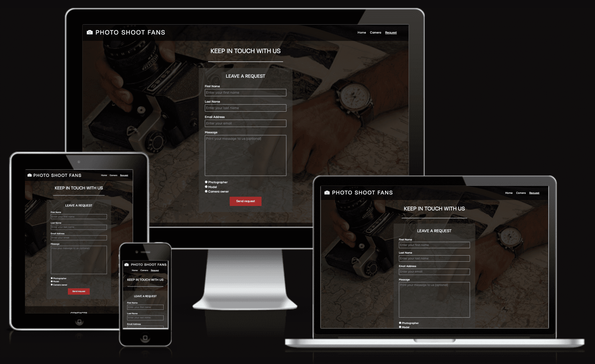
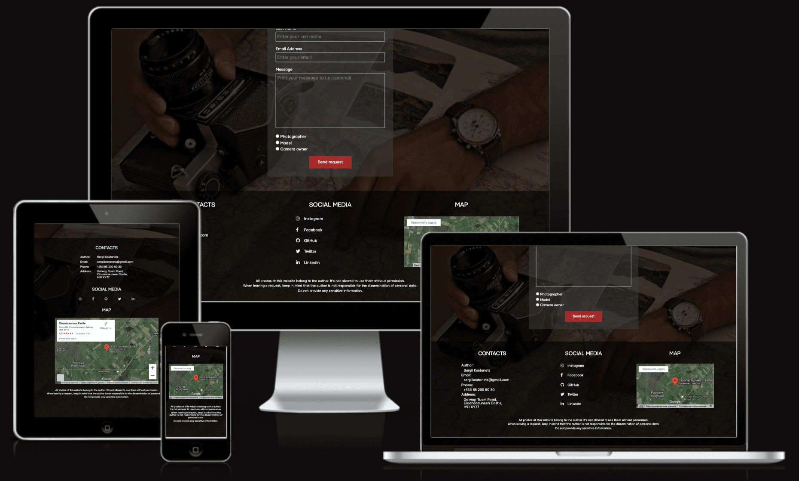
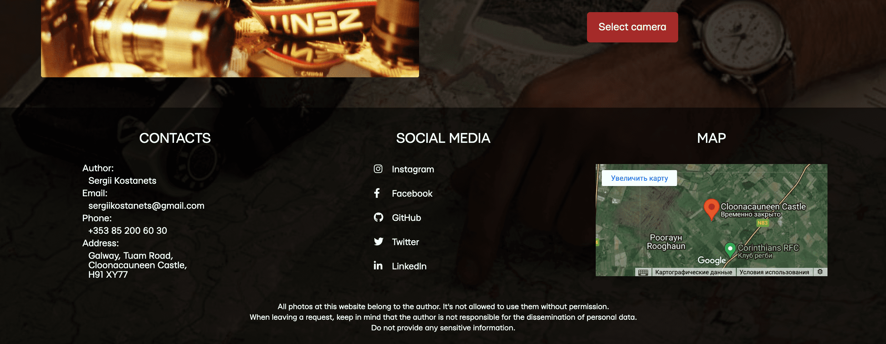

# Sergii Kostanets [Codeinstitute](https://codeinstitute.net) first project

[Photo Shoot Fans](https://sergii-kostanets.github.io/codeinstitute-photo-shoot-fans/) is a photoshoot booking site for clients and photographers who need a photo with a specific camera.

откуда взял шрифты
https://fontsinuse.com/typefaces/203938/mariupol
https://rentafont.com/fonts/mariupol?sample_text=Mariupol%2520font%2520test

# **_Photo Shoot Fans_**

Photo Shoot Fans is a resource for finding a photographer, model or rare camera to arrange a photo session. The target audience of the site is professional photographers who need a model who understands photography and is interested in rare cameras. As well as photographers and models experienced in photography, who want a photo on a specific camera or lens. Owners of rare cameras will be interested in this resource, as they have the opportunity to earn money by renting equipment.

Welcome to [Photo Shoot Fans](https://sergii-kostanets.github.io/codeinstitute-photo-shoot-fans) on GitHub Pages.

# Contents

* [**User Experience UX**](<#user-experience-ux>)
    * [Responsivenes](<#responsivenes>)
    * [Site Structure](<#site-structure>)
* [**Features**](<#features>)
    * [**Home**](<#navigation-menu>)
         * [Navigation menu](<#navigation-menu>)
         * [Blocks with main content](<#blocks>)
         * [Footer](<#footer>)
    * [**Camera**](<#camera>)
        * Hardware image
        * Examples of photos for this equipment
        * Motivation to action
    * [**Request**](<#request>)
       * Request form
       * Submit button
    * [**Future Features**](<#future-features>)
* [**Technologies Used**](<#technologies-used>)
* [**Testing**](<#testing>)
* [**Deployment**](<#deployment>)
* [**Credits**](<#credits>)
    * [**Content**](<#content>)
    * [**Media**](<#media>)
*  [**Acknowledgements**](<#acknowledgements>)

# User Experience (UX)

## Responsivenes

Website [Photo Shoot Fans](https://sergii-kostanets.github.io/codeinstitute-photo-shoot-fans) has fully responsive design which looks amazing on any device, from widescreen monitors to the smallest mobile phone screens.

The responsiveness of the main page is shown above. Below you can see the responsiveness of the camera selection page:

The responsiveness of the request page:

Page footer responsiveness:

[Back to top](<#contents>)

## Site Structure

[Photo Shoot Fans](https://sergii-kostanets.github.io/codeinstitute-photo-shoot-fans) website has three pages. The [home page](index.html) is the default loading page, [camera](camera.html) and [request](request.html) pages are all accessible primarily from the navigation menu. There are another links to the request page and camera page in the home page and camera page to inspire the user for the next step.

[Back to top](<#contents>)

# Features

[Photo Shoot Fans](https://sergii-kostanets.github.io/codeinstitute-photo-shoot-fans) contains many features that the user would be familiar with, such as a navigation bar, footer with contact links and contact form. The site is built in such a way as to encourage the user to submit a form with contact information.

## Existing Features
  * ### Navigation Menu

    * Sited at the top of all the pages in the site, it is fully responsive and contains links to all the pages of the site to enable ease of navigation in one convenient location.
    * The logo icon is clickable with a link back to the home page for enhanced UX.
    * The logo text isn't clickable to make it easier to copy the site name and share it.

[Back to top](<#contents>)

  * ### Blocks with main content

      * Located on the home page beneath the title section. The main content blocks are designed to be hidden when a service is suspended, or easily added when services are added. Each block ends with a button to encourage the visitor to go to the page for filling out a form or choosing a camera.
      * Each block is responsive and restructures when the display is scaled down. Keeping the general idea of encouraging the visitor to explore the site further.

[Back to top](<#contents>)

* ### Footer

    * Contains contacts of the author of the site.
    * Contains social media links. To enhance the UX the links open in other tabs.
    * The social media presence will help the user with their research of referencies and will also encourage them to connect with owner.
    * The GitHub, LinkedIn and Twitter social links are there for the potential employers, to direct to the site owner's pages.
    * Contains a map for visual understanding of the author's location.
    * Contains copyright notice.

[Back to top](<#contents>)

* ### Camera

    * The camera page give the user a choice of equipment for shooting.
    * Blocks with the choice of equipment contain the name and photo of the camera itself, as well as the name of the lens and examples of photos taken on this camera with this lens.
    * Blocks are easily duplicated, allowing you to quickly add new cameras to the range.
    * Each block ends with a button to go to the form fill page to inspire the user to continue the journey.

[Back to top](<#contents>)

* ### Request

    * This section should complete the online journey for the user. It has request form for every type of client.
    * Form has 5 input fields: first name, last name, email, message and type of client.

[Back to top](<#contents>)

## Future Features

* Make the submit form work properly by emailing the owner.
    * Add a page with a message about successful submission.
    * Connect and set up a database to automatically save each request.
    * Create a page to view and filter data from the database.
* Add more cameras to camera page.
    * Create a slider with sample shots for this camera.
    * Introduce swipe actions for use on mobile devices for this slider.

[Back to top](<#contents>)

# Technologies Used
* [HTML5](https://html.spec.whatwg.org/) - provides the content and structure for the website.
* [CSS3](https://www.w3.org/Style/CSS/Overview.en.html) - provides the styling.
* [Visual Studio Code](https://code.visualstudio.com/) - IDE used to develop the website.
* [Github](https://github.com/) - used for versin control, to deploy and host the website.
* [I Love IMG](https://www.iloveimg.com/) - online photo editor to crop and resize photos.

[Back to top](<#contents>)

________________________________________________________________________________________________
# Testing

Please refer to [**_here_**](TESTING.md) for more information on testing Wawas Woods.

[Back to top](<#contents>)

# Deployment

### **To deploy the project**
The site was deployed to GitHub pages. The steps to deploy a site are as follows:
  1. In the GitHub repository, navigate to the **Settings** tab.
  2. Once in Settings, navigate to the **Pages** tab on the left hand side.
  3. Under **Source**, select the branch to **master**, then click **save**.
  4. Once the master branch has been selected, the page will be automatically refreshed with a detailed ribbon display to indicate the successful deployment.

  The live link to the Github repository can be found here - https://github.com/EwanColquhoun/wawaswoods

### **To fork the repository on GitHub**
A copy of the GitHub Repository can be made by forking the GitHub account. This copy can be viewed and changes can be made to the copy without affecting the original repository. Take the following steps to fork the repository;
1. Log in to **GitHub** and locate the [repository](https://github.com/EwanColquhoun/wawaswoods).
2. On the right hand side of the page inline with the repository name is a button called **'Fork'**, click on the button to create a copy of the original repository in your GitHub Account.

### **To create a local clone of this project**
The method from cloning a project from GitHub is below:

1. Under the repository’s name, click on the **code** tab.
2. In the **Clone with HTTPS** section, click on the clipboard icon to copy the given URL.

3. In your IDE of choice, open **Git Bash**.
4. Change the current working directory to the location where you want the cloned directory to be made.
5. Type **git clone**, and then paste the URL copied from GitHub.
6. Press **enter** and the local clone will be created.

[Back to top](<#contents>)

# Credits
### Content

* The font came from [Google Fonts](https://fonts.google.com/).
* The map is embedded from [Google Maps](https://www.google.com/maps).
* The colour palate was compiled by [Colormind](http://colormind.io/).
* The icons came from [Font Awesome](https://fontawesome.com/).
* The form validation idea came from a [YouTube tutorial](https://www.youtube.com/watch?v=fNcJuPIZ2WE).
* The code for the Safari specific styling was inspired by an example on [Stack Overflow](https://stackoverflow.com/).
* The inspiration for the Project page sliders came from this repository on [GitHub](https://gist.github.com/zhilinskiy/4603199).
* [Balsamiq](https://balsamiq.com/wireframes/) was used to create the wireframes.

### Media
* The photos all came from the developer, [Ewan Colquhoun](https://www.linkedin.com/in/ewan-colquhoun-2b3535213/).
* The photos were compressed using [Compressor](https://compressor.io/).

[Back to top](<#contents>)

# Acknowledgements
The site was completed as a Portfolio 1 Project piece for the Full Stack Software Developer (e-Commerce) Diploma at the [Code Institute](https://codeinstitute.net/). As such I would like to thank my mentor [Precious Ijege](https://www.linkedin.com/in/precious-ijege-908a00168/), the Slack community, and all at the Code Institute for their help and support. Wawas Woods is a fictional company but it exists in everything but the business title. Currently it is more of a hobby!

Ewan Colquhoun 2021.

[Back to top](<#contents>)