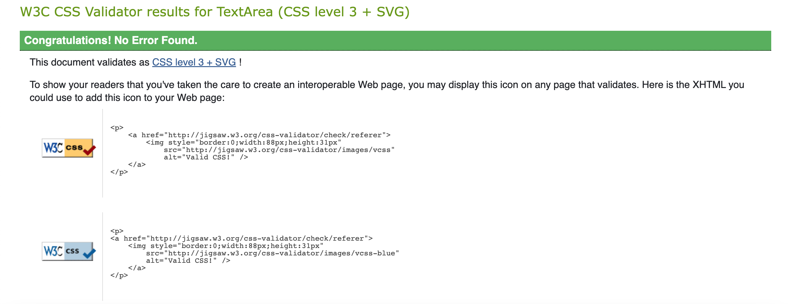
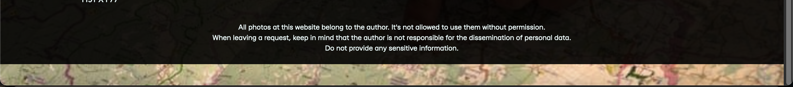
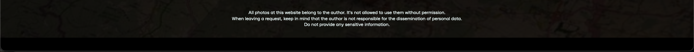

# Testing
## Code Validation
The [Photo Shoot Fans](https://sergii-kostanets.github.io/codeinstitute-photo-shoot-fans) site has be throughly tested. All the code has been run through the [W3C html Validator](https://validator.w3.org/) and the [W3C CSS Validator](https://jigsaw.w3.org/css-validator/). Minor errors were found on the home and inspiration pages. After a fix and retest, no errors were returned for both.

The HTML validator results for each page are below:

* Home page

* Camera page

* Request page

The CSS validator results are below:

## Responsiveness Test

* The responsive design tests were carried out manually with [Google Chrome DevTools](https://developer.chrome.com/docs/devtools/) and [Am I Responsive](https://ui.dev/amiresponsive?url=https://sergii-kostanets.github.io/codeinstitute-photo-shoot-fans).

|        | Galaxy Fold | Galaxy A51 | iPhone 5 | iPad Air | iPad Mini | Display <1200px | Display >1200px |
|--------|-------------|------------|----------|----------|-----------|-----------------|-----------------|
| Render | pass        | pass       | pass     | pass     | pass      | pass            | pass            |
| Images | pass        | pass       | pass     | pass     | pass      | pass            | pass            |
| Links  | pass        | pass       | pass     | pass     | pass      | pass            | pass            |

Note: On wide display types the section with main content of the site are restricted in width to 1500px. This helps the UX by not spreading the content too wide on the extra wide screens.

## Browser Compatibility

[Photo Shoot Fans](https://sergii-kostanets.github.io/codeinstitute-photo-shoot-fans) site was tested on the following browsers with no visible issues for the user.
Google Chrome, Opera, Microsoft Edge, Safari and Mozilla Firefox. Appearance, functionality and responsiveness were consistent throughout for a range of device sizes and browsers.

## Known Bugs
* ### Resolved

    * Request page - failed to change the border color of the input when focusing on it.

        Approach 1 (failed):

        

        Approach 2 (failed):

        

        Approach 3 (success):

        

        Before setting a custom color, it is better to remove the standard browser behavior.

    * Request page - failed to change the border color of the input when focusing on it.

        Approach 1 (failed):

        

        Approach 2 (success):

        

        Adding padding fixed the issue.

* ### Unresolved

    * The bug appears when scrolling with the trackpad on MacOS in the Firefox browser:

        Header

        

        Footer

        

    * The bug appears when scrolling with the trackpad on MacOS in the Safari browser:

        Header

        

        Footer

        

    * Expected behavior:

        Header

        

        Footer

        

        Also alternative expected behavior: no scroll beyond the page.

    * Planned solution:

        In the gitpod editor console one problem flags up within the CSS. To enable the site to perform properly on all versions of Safari a 'media query with Prescribing specific settings for certain browsers.

        With prefix:

            1. For Firefox:

            * {
                -moz-overscroll-behavior: none;
            }

            2. For Safari, Chrome and Opera:

            * {
                -webkit-overscroll-behavior: none;
            }

        With @media rule:

            1. For Firefox:

            @-moz-document url-prefix() {
                .ff {
                    overscroll-behavior: none;
                }
            }

            1. For Safari:

            _::-webkit-full-page-media, _:future, :root .safari_only {
                property: value;
            }

            or

            @media not all and (min-resolution:.001dpcm) {
                @media {
                    .safari10 {
                        color:#0000FF;
                        background-color:#CCCCCC;
                    }
                }
            }

## Additional Testing
### Lighthouse
The site was also tested using [Google Lighthouse](https://developers.google.com/web/tools/lighthouse) in Chrome Developer Tools to test each of the pages for:
* Performance - How the page performs whilst loading.
* Accessibility - Is the site acccessible for all users and how can it be improved.
* Best Practices - Site conforms to industry best practices.
* SEO - Search engine optimisation. Is the site optimised for search engine result rankings.

As an example the results for [Photo Shoot Fans](https://sergii-kostanets.github.io/codeinstitute-photo-shoot-fans) home page:

As an example the results for [Photo Shoot Fans](https://sergii-kostanets.github.io/codeinstitute-photo-shoot-fans) camera page::

As an example the results for [Photo Shoot Fans](https://sergii-kostanets.github.io/codeinstitute-photo-shoot-fans) request page:

This part of the testing process showed up that the site was slow to load, mainly due to the image sizes. All the images needed to be compressed before adding to the repository. Once this was done the performance went from ~60% to ~100%.

### Peer review
In addition to the above testing the beta version of the site was put through its paces by peers, both in the software development field and outside. The results highlighted responsive design weakness for a type of mobile device that was rectified with minor CSS amendments. There were also minor spelling and grammar errors that have since been fixed.

Back to [README.md](./README.md#testing).